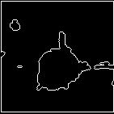
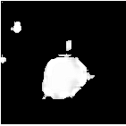

# Pulmonary_Nodule_Detection
Hybrid Preprocessing Using Bilateral Filter and Area based Contouring for Pulmonary Nodule Detection

Detection of pulmonary nodules from CT scan using hybrid preprocessing by Bilateral Filter removes the noise and blurs the image while keeping the edges sharp. Then finding all the contours and showing only those which are larger than a specified size since all nodule exist with size of diameter (5-30mm).

Using such method for detection of pulmonary nodules at early stages helps cancer patient and researchers as well.

nux.png is the sample input image and one_op.png is the preprocessed output of using method_one.py on nux.png
and two_op.png is the preprocessed output of using method_two.py on nux.png.

Dependencies : Opencv version 3.4.1 used with Python 3.6.5 on ArchLinux

Original image 'nux.png'  (nux.png)

Output of using method_one.py on nux.png  

Output of using method_two.py on nux.png  
